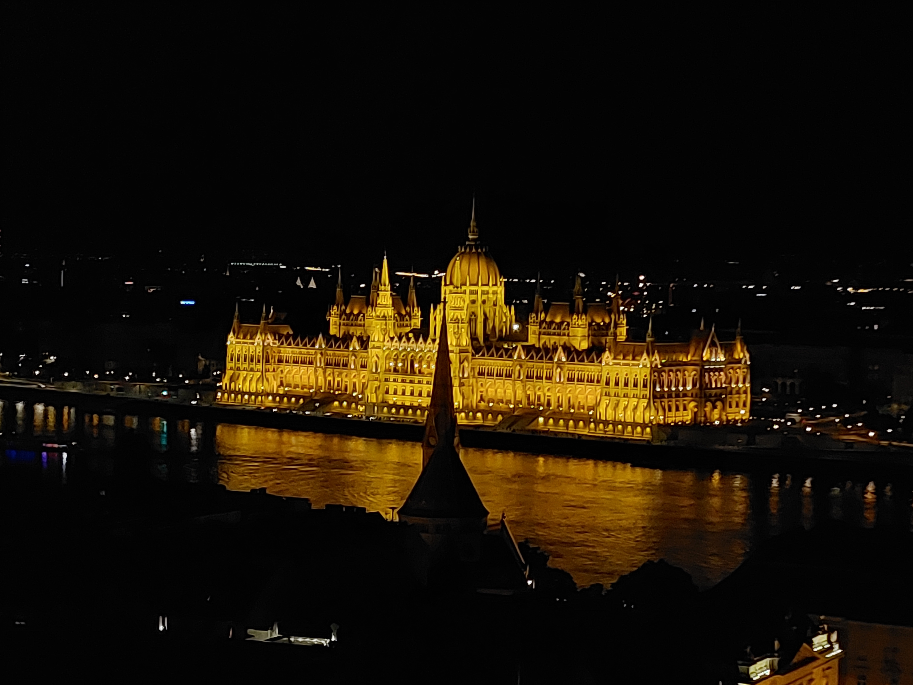

I presented the work on a 16-pixel photoconductive THz emitter capable of generating azimuthal and radial beams via electrical control at the 9th International Conference on Optical Terahertz Science and Technology, 19-23rd June 2022 (OTST 2022).

[Download the presentation here](../files/OTST2022_rad_az_THz_beams_JD.pdf)

 